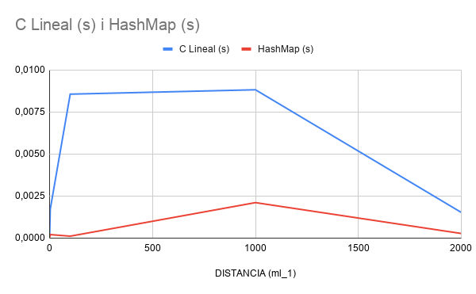

# Report

## Runtime complexity analysis of initializing the intersections map in Big-O.

El mapa d'interseccions s'inicialitza recorrent tots els segments del carrer i posant-lo dins del hashmap d'interseccions.
Li direm `n` al nombre de segments del carrer (tros de intersecció a intersecció).

### Best case
El millor cas de la funció hash serà quan es posin les interseccions correctament entre els buckets del hashmap. Cada cop que inserim el cost és de **O(1)** i com inserim `n` vegades (una vegada cada carrer), el cost total és: **O(n)**.

### Average case
Això passa quan el hashmap té poques col·lisions i les insercions poden continuar tenint un cost constant. Per tant aquest cas és com l'anterior i la complexitat total continua sent: **O(n)**.

### Worst case
El pitjor cas es produirà quan moltes de les interseccions xoquen al mateix bucket. Això fa que cada inserció pugui arribar a costar **O(n)**. I per tant com hi ha `n` insercions, la seva complexitat total és: **O(n²)**.

---

## Runtime complexity analysis of finding the coordinates of a street or place given the name in Big-O.

Quan busquem carrers o llocs utilitzem una cerca seqüencial amb una linked list. Direm `n` el nombre de cases o llocs que emmagatzemem.

### Best case
El millor cas és quan el carrer/lloc es troba en el primer node de la llista i la seva complexitat és de **O(1)**.

### Average case
Això passa quan hem de recórrer aproximadament la meitat de la llista fins que trobem el resultat i per tant la seva complexitat serà **O(n)**.

### Worst case
El pitjor cas es produirà quan el carrer/lloc estigui en l'últim node de la llista i per tant com haurem de recórrer tota la llista, la seva complexitat serà **O(n)**.

---

## Runtime complexity analysis of your path-finding algorithm in Big-O.

L'algoritme que utilitzem per trobar les rutes és el BFS utilitzant el graf d'interseccions. Li direm `V` al nombre d'interseccions i `E` al nombre de segments.

### Best case
El millor cas és quan el destí es troba molt aprop de l'origen i el BFS troba el camí final després de mirar molt pocs nodes i per tant la complexitat és aproximadament **O(1)**.

### Average case
Això passa quan el BFS ja ha explorat una part significativa (com la meitat) del graf. Com que cada intersecció i cada segment es visiten com a màxim una vegada, la complexitat serà **O(V+E)**.

### Worst case
El pitjor cas es produirà quan el BFS hagi d'explorar pràcticament tot el graf abans de trobar el camí final o dir que no hi ha, i per tant la seva complexitat és de **O(V+E)**.

En la nostra implementació hi ha un sobrecost addicional ja que cada cop que expandim, fem una còpia.

---

## A plot comparing the latency to find connected streets sequentially vs using the intersections map, depending on the map size.

| Map   | LS (ms)           | T (ms) | HM (ms)           | T (ms) |
|-------|-------------------|--------|-------------------|--------|
| xs_1  | 0.165 0.043 0.188 | 0.132  | 0.086 0.014 0.005 | 0.035  |
| xs_2  | 0.039 0.068 0.067 | 0.058  | 0.014 0.029 0.031 | 0.024  |
| md_1  | 0.043 0.098 0.137 | 0.092  | 0.015 0.024 0.054 | 0.031  |
| lg_1  | 0.073 0.077 0.059 | 0.069  | 0.087 0.043 0.023 | 0.051  |
| xl_1  | 0.161 0.244 0.152 | 0.179  | 0.034 0.029 0.033 | 0.032  |
| 2xl_1 | 0.492 0.845 0.516 | 0.617  | 0.049 0.044 0.047 | 0.046  |

Podem veure que la versió del LAB 4 (Lineal Search) normalment triga més que la del LAB 5 (HashMap) i més quan el fitxer és més gran. Això passa perquè la cerca lineal ha de recórrer tots els carrers fins a trobar quins estan connectats mentre que el hashmap pot anar directament a la intersecció que busquem i obtenir els carrers connectats molt més ràpid. Tot això comentat és els apartats anteriors posats en pràctica, on LS el pitjor cas és **O(n²)** i a HM és **O(n)**.

---

## A plot comparing the latency to find a path between two points using sequential search vs hashmap, depending on the map size.

| Map   | C Lineal (ms)           | T (ms)  | HashMap (ms)      | T (ms) |
|-------|-------------------------|---------|-------------------|--------|
| xs_1  | 0.047 0.086 0.091       | 0.074   | 0.017 0.037 0.038 | 0.030  |
| xs_2  | 0.157 0.099 0.092       | 0.116   | 0.051 0.042 0.039 | 0.044  |
| md_1  | 0.947 0.870 0.927       | 0.914   | 0.237 0.127 0.167 | 0.177  |
| lg_1  | 2.366 4.089 2.398       | 2.951   | 0.052 0.060 0.051 | 0.054  |
| xl_1  | 248.317 300.434 251.224 | 266.658 | 4.432 4.527 4.481 | 4.480  |
| 2xl_1 | 5.681 4.317 4.959       | 4.985   | 0.026 0.026 0.027 | 0.026  |

Un cop més podem veure la diferència entre les dues eficiències del HashMap i de la cerca lineal. La versió lenta (CL) té una complexitat aproximada de **O(E²)**, ja que per cada expansió del BFS cal recórrer tota la llista de carrers per trobar les connexions. La versió amb hashmap té una complexitat **O(V + E)**, ja que les connexions d'una intersecció es poden obtenir utilitzant la taula hash.

---

## A plot comparing the latency to find a path depending on the distance between origin and destination.

| Distance | C Lineal (ms) | HashMap (ms) |
|----------|---------------|--------------|
| 0        | 0.086         | 0.037        |
| +3       | 1.719         | 0.208        |
| 100      | 8.561         | 0.114        |
| 1000     | 8.822         | 2.110        |
| últim c  | 1.527         | 0.274        |

Un cop més podem observar la diferència de rendiment entre la cerca lineal i el HashMap. La versió amb cerca lineal té un temps d'execució una mica més elevat, ja que en cada expansió del BFS ha de recórrer tota la llista de carrers per trobar les connexions disponibles. En canvi, amb la versió amb HashMap obtenim directament els carrers connectats a cada intersecció.

En aquest cas no veiem que en cap dels dos casos puguem relacionar la distància i el temps amb una proporcionalitat directa. Això passa perquè el cost del BFS no depèn únicament de la distància física entre l'origen i el final, sinó també en el nombre de nodes i carrers que han de ser explorats abans d'arribar al final. Tot i així, es manté la tendència que hem pogut veure en els apartats anteriors en què la cerca lineal tendeix a ser més lenta que el HashMap.

---

## Describe an improvement to the visited data structure in the BFS algorithm to improve latency.

Inicialment els segments que visitàvem els anàvem guardant en una llista enllaçada. Un cop els havíem guardat, per poder comprovar si aquell segment ja l'havíem visitat havíem de recórrer seqüencialment tota la llista fins trobar-lo o arribar fins al final.

Per millorar la latència vam substituir això per una taula hash (`VisitedSet`). Fent una funció hash, cada segment es guarda en una posició concreta de la taula, fent així que puguem accedir-hi molt més ràpid.

Això és perquè una taula hash és una estructura adequada perquè l'operació que més utilitzem durant el BFS és comprovar si un segment ja ha estat visitat. Com ho utilitzem tantes vegades fem que es redueixi el cost i això afecta directament en el temps total d'execució.

| OPERACIÓ        | LLISTA | HASHMAP |
|-----------------|--------|---------|
| Buscar visitat  | O(n)   | O(1)    |
| Afegir visitat  | O(1)   | O(1)    |
| BFS complet     | O(n)   | O(1)    |

Amb la llista enllaçada, la comprovació d'un segment visitat tenia una complexitat **O(n)**, ja que podíem arribar a recórrer tots els elements de la llista. Amb la taula hash, aquesta operació passa a tenir una complexitat **O(1)** de mitjana, ja que l'accés es fa directament a través de l'índex calculat per la funció de hash.

El principal inconvenient d'utilitzar una taula hash és que augmenta molt la memòria que necessitem, ja que cal reservar espai per als buckets de la taula encara que alguns no s'utilitzin. A més, en el pitjor cas poden produir-se col·lisions, fent que diverses entrades comparteixin el mateix bucket. En aquesta situació, la complexitat podria degradar-se fins a **O(n)** però segueix sent la mateixa que la de la llista.

---

## Describe an improvement to the algorithm to find the street segment given a latitude and longitude to improve its runtime complexity / latency.

**Complexitat actual:** `findClosestStreet` recorre tota la llista de carrers calculant la distància a cada segment → **O(n)**.

**Millora:** Usar un **k-d tree**. Organitza els segments per coordenades (lat, lon) en un arbre binari que divideix l'espai alternant per lat i lon. Per buscar el segment més proper, baixa per l'arbre descartant branques que no poden contenir el resultat → **O(log n)** de mitjana.

**Avantatges:**
- La cerca és molt més ràpida: **O(log n)** en lloc de **O(n)**
- Com més gran és el mapa, més notable és la millora

**Inconvenients:**
- Necessita memòria extra **O(n)** per construir l'arbre
- Construir l'arbre costa **O(n log n)** al principi
- Més complex d'implementar que la cerca lineal
- En el cas pitjor (arbre desequilibrat) pot ser **O(n)** igualment
