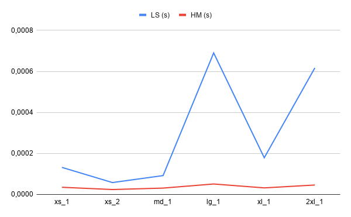
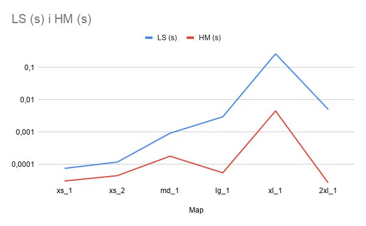

# Report

## Runtime complexity analysis of initializing the intersections map in Big-O. / Quant costa en temps crear el hashmap de interseccions.
El mapa d'interseccions s'inicialitza recorrent tots els segments del carrer i posan-lo dins del hasmap d'interseccions.
Li direm 'n' al numeros de segments del carrer (troç de intersecció a intersecció).

### Best case
El millor cas de la funció hash serà quan es posin les interseccons correctament entre els buckets del hashmap. Cada cop que inserim el cost es de O(1) i com inserim 'n' vegades (una vegada cada carrer), el cost total és: O(n).

### Average case
Això passa quan el hasmap té poque col·lisions i les insercions poden continuar tenint un cost constant. Per tant aquest cas és com l'anterior i la complexitat total conitua sent: O(n)

### Worst case
El pitjor cas es produirà quan moltes de les interceccions xoquen al mateix bucket. Això fa que cada inserció pugui arribar a costar O(n). I per tant com hi ha n insercions, la seva complexitat total és: O(n^2).

## Runtime complexity analysis of finding the coordinates of a street or place given the name in Big-O. / Quant costa trobar un carrer o un lloc.
Quan busquem carrers o llocs utilitzem una cerca seqüencial amb una linked list. Direm 'n' el nombre de cases o llocs que emmagatzemem.

### Best case
El millor cas és quan el carrer/lloc es troba en el primer node de la llista i la seva complexitat es de O(1). 

### Average case
Això passa quan hem de recorrer aproximadament la meitat de la llista fins que trobem el resultat i per tant la seva complexitat serà O(n). 

### Worst case
El pitjor cas es produirà quan el carrer/lloc estigui en el últim node de la llista i per tant com haurem de recorrer tota la llista, la seva complexitat ser O(n). 

## Runtime complexity analysis of your path-finding algorithm in Big-O.
El algoritme que utilitzem per trober les rutes és el BFS utilitzant el graf d'interseccions. Li direm 'V' al nombre d'interseccions i 'E' al nombre de segments.

### Best case
El millor cas és quan el destí es troba molt aprop de l'origen i el BFS troba el camí final després de mirar molt pocs nodes i per tant la complexitat és aproximadament O(1). 

### Average case
Això passa quan el el BFS ja ha explorat una part significativa (com la meitat) del graf. Com que cada intersecció i cada segment es visiten com a màxim una vegada, la complexitat serà O(V+E).

### Worst case
El pitjor cas es produirà quan el BFS hagi d'explorar pràcticament tot el graf abans de trobar el camí final o dir que no hi ha i per tant la seva complexitat es de O(E+V).

En la nostre implementació hi ha un sobrecost adicional ja que cada cop que expandim, fem una copia.

## A plot comparing the latency to find connected streets by sequentially looking through the list (lab 4) compared to using the intersections map (lab 5), depending on the map size. Experimentally determine the results by measuring multiple times your program's behaviour with different relevant scenarios in the same machine. Include your raw data in the report, besides the plot. Explain the results.
| Map  ||     LS (ms)       | T (ms)||     HM (ms)       | T(ms) |
| xs_1 || 0.165 0.043 0.188 | 0.132 || 0.086 0.014 0.005 | 0.035 |
| xs_2 || 0.039 0.068 0.067 | 0.058 || 0.014 0.029 0.031 | 0.024 |
| md_1 || 0.043 0.098 0.137 | 0.092 || 0.015 0.024 0.054 | 0.031 |
| lg_1 || 0.073 0.077 0.059 | 0.690 || 0.087 0.043 0.023 | 0.051 |
| xl_1 || 0.161 0.244 0.152 | 0.179 || 0.034 0.029 0.033 | 0.032 |
| 2xl_1|| 0.492 0.845 0.516 | 0.617 || 0.049 0.044 0.047 | 0.046 |

Podem veure que la versió del LAB 4 (Lineal Search) normalment triga més que la del LAB 5 (HashMap) i més quan el fitxer és més gran. Això passa perque la cerca lineal ha de recòrrer tots els carrers fins a trobar quins estan connectats mentre que el hashmappot anar directament a la intersecció que busquem i obtenir els carrers conectats molt més ràpid. Tot això comentat és els partats anteriors posats en pràctica, on LS el pitjor cas és O(n^2) i a HS és O(n).

## A plot comparing the latency to find a path between two points finding connected streets sequentially looking through the list compared to using the intersections map, depending on the map size (but keeping the same origin and destination). Experimentally determine the results by measuring multiple times your program's behaviour with different relevant scenarios in the same machine. Include your raw data in the report, besides the plot. Explain the results.
| Map  ||  C Lineal (ms)    | T (ms)||   HashMap (ms)    | T(ms) |
| xs_1 || 0.047 0.086 0.091 | 0.074 || 0.017 0.037 0.038 | 0.030 |
| xs_2 || 0.157 0.099 0.092 | 0.116 || 0.051 0.042 0.039 | 0.044 |
| md_1 || 0.947 0.870 0.927 | 0.914 || 0.237 0.127 0.167 | 0.177 |
| lg_1 || 2.366 4.089 2.398 | 2.951 || 0.052 0.060 0.051 | 0.054 |
| xl_1 || 248.317 300.434 251.224 | 266.658 || 4.432 4.527 4.481 | 4.480 |
| 2xl_1|| 5.681 4.317 4.959 | 4.985 || 0.026 0.026 0.027 | 0.026 |

Un cop més podem veure la diferencia entre les dos eficiènices del HashMap i de la cerca lineal. La versió lenta (CL) té una complexitat aproximada de O(E²), ja que per cada expansió del BFS cal recórrer tota la llista de carrers per trobar les connexions. La versió amb hashmap té una complexitat O(V + E), ja que les connexions d'una intersecció es poden obtenir utilitzant la taula hash.

## A plot comparing the latency to find a path between two points finding connected streets sequentially looking through the list compared to using the intersections map, depending on the distance between the origin and destination (but using the same map).Experimentally determine the results by measuring multiple times your program's behaviour with different relevant scenarios in the same machine. Include your raw data in the report, besides the plot. Explain the results. Fit a curve and justify it based on the runtime complexity from question 3.

| Distance | C Lineal (ms) | HashMap (ms) |
|    0     |     0.405     |     0.012    |
|    +3    |     2.405     |     0.031    |
|   100    |     5.622     |     0.031    |
|   1000   |     5.406     |     0.037    |
| ultim c  |     4.343     |     0.035    |